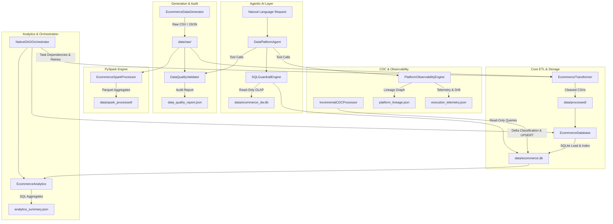

# Agentic E-Commerce Data Engineering Platform

An end-to-end data engineering platform demonstrating the full lifecycle of relational e-commerce data — from synthetic generation through analytics, warehousing, and AI-assisted querying.

**Built with:** Python 3.13 · SQLite · PySpark 3.5 · Pandas · NumPy · PyTest · Java/OpenJDK 21

**Test Status:** 90 tests passing (82 standard + 8 PySpark)

---

## Key Highlights

- **Synthetic relational data generation** — produces customers, products, orders, payments, and reviews with referential integrity
- **Data quality auditing** — automated null%, schema, and referential integrity checks with JSON audit reports
- **ETL / transformation pipeline** — cleans, normalizes, and loads raw CSVs into indexed SQLite tables
- **SQL analytics engine** — executive KPIs, revenue reconciliation, category drill-downs, and monthly trends
- **Native DAG orchestrator** — topological task sorting, exponential backoff retries, and status persistence
- **Simulated local batch CDC** — INSERT / UPDATE / NO_CHANGE classification with idempotent SQLite UPSERT
- **Data lineage and observability** — directed graph export, execution telemetry, schema drift detection, and metric variance
- **PySpark processing** — distributed aggregation with Parquet data lake output
- **Star Schema data warehouse** — conformed dimensions (`dim_customer`, `dim_product`, `dim_date`) and `fact_sales` with surrogate keys
- **Agentic data engineering assistant** — natural-language intent router with strict read-only SQL guardrails
- **Unified CLI** — single entry point (`run_platform.py`) for all 11 platform capabilities

---

## Table of Contents

1. [Architecture & Data Flow](#architecture--data-flow)
2. [Technology Stack](#technology-stack)
3. [Milestones (1–11)](#milestones-111)
4. [Quick Start](#quick-start)
5. [CLI Commands](#cli-commands)
6. [Data Warehouse & Star Schema](#data-warehouse--star-schema)
7. [Agentic Assistant & Read-Only Safety](#agentic-assistant--read-only-safety)
8. [CDC Clarification](#cdc-clarification)
9. [Security & Safety](#security--safety)
10. [PySpark Processing](#pyspark-processing)
11. [Testing](#testing)
12. [Why This Project Matters](#why-this-project-matters)
13. [Limitations & Scope](#limitations--scope)
14. [Project Structure](#project-structure)

---

## Architecture & Data Flow



---

## Technology Stack

| Component | Technology | Version |
|-----------|-----------|---------|
| Core runtime | Python | 3.13.5 |
| PySpark runtime | Python | 3.12.10 |
| Distributed processing | PySpark | 3.5.4 |
| JVM runtime | OpenJDK | 21.0.1 |
| Relational storage | SQLite | 3 |
| Data manipulation | Pandas, NumPy | — |
| Parquet output | PyArrow | — |
| Testing | PyTest | — |
| Orchestration | Native DAG engine | custom |
| Agent engine | Intent router + SQL guardrails | custom |

**Dual Environment Architecture:**

| Environment | Python | Purpose |
|-------------|--------|---------|
| `.venv` | 3.13.5 | Core pipelines, SQLite, analytics, orchestration, agent |
| `.venv_spark` | 3.12.10 | PySpark processing, Parquet exports |

The separate PySpark environment exists because PySpark 3.5.4 requires a C-API-compatible Python build. Python 3.13 has C-API changes that break PySpark's `py4j` bridge.

---

## Milestones (1–11)

| # | Milestone | Capability | Main Implementation |
|---|-----------|-----------|---------------------|
| 1 | Synthetic Data Generation | Produces 5 relational entities with referential integrity | `src/generator.py` — `EcommerceDataGenerator` |
| 2 | Data Quality Audit | Null%, schema, and referential integrity validation | `src/validator.py` — `DataQualityAuditor` |
| 3 | ETL Transformation | Cleans, normalizes, and standardizes raw data | `src/transformer.py` — `EcommerceTransformer` |
| 4 | SQLite Storage | Indexed schema creation and CSV ingestion | `src/database.py` — `EcommerceDatabase` |
| 5 | SQL Analytics | Executive KPIs, revenue reconciliation, trend analysis | `src/analytics.py` — `EcommerceAnalytics` |
| 6 | DAG Orchestration | Topological sort, retries, status persistence | `src/orchestrator.py` — `NativeDAGOrchestrator` |
| 7 | PySpark Processing | Distributed aggregation, Parquet data lake output | `src/spark_processor.py` — `EcommerceSparkProcessor` |
| 8 | Unified CLI | Single entry point for all platform capabilities | `src/cli.py` — `EcommercePlatformCLI` |
| 9 | CDC & Observability | Batch CDC merge, lineage, telemetry, drift detection | `src/incremental.py`, `src/observability.py` |
| 10 | Data Warehouse | Star Schema with surrogate keys and OLAP queries | `src/warehouse.py` — `EcommerceDataWarehouse` |
| 11 | Agentic Assistant | Natural-language interface with SQL guardrails | `src/agent.py` — `DataPlatformAgent` |

---

## Quick Start

```powershell
# 1. Activate the primary environment
.\.venv\Scripts\Activate.ps1

# 2. Run the full platform end-to-end (Milestones 1–11)
python run_platform.py --all

# 3. Run standard test suite (82 tests)
python -m pytest

# 4. Run PySpark test suite (8 tests)
.\.venv_spark\Scripts\python.exe -m pytest tests/test_spark.py -v
```

---

## CLI Commands

The unified CLI (`run_platform.py`) supports the following flags:

| Flag | Description |
|------|-------------|
| `--generate` | Run synthetic data generation |
| `--audit` | Run data quality audit |
| `--pipeline` | Run ETL pipeline (transform + load) |
| `--analytics` | Run SQL analytics & KPIs |
| `--orchestrate` | Run native DAG orchestrator |
| `--spark` | Run PySpark distributed processing |
| `--incremental` | Run incremental CDC batch merge |
| `--observability` | Generate platform lineage & telemetry |
| `--warehouse` | Build Star Schema data warehouse |
| `--agent "query"` | Run agent with a natural-language query |
| `--agent-interactive` | Launch interactive agent session |
| `--report` | Generate platform summary report |
| `--all` | Run full platform workflow end-to-end |

```powershell
# Examples
.\.venv\Scripts\python.exe run_platform.py --generate
.\.venv\Scripts\python.exe run_platform.py --analytics
.\.venv\Scripts\python.exe run_platform.py --agent "Show me top products by revenue"
.\.venv\Scripts\python.exe run_platform.py --all
```

---

## Data Warehouse & Star Schema

The warehouse engine (`src/warehouse.py`) builds a Star Schema in `data/ecommerce_dw.db`:

**Dimensions:**

| Table | Key | Description |
|-------|-----|-------------|
| `dim_customer` | `customer_key` (surrogate) | Customer attributes with encoded signup channels |
| `dim_product` | `product_key` (surrogate) | Product attributes with encoded categories |
| `dim_date` | `date_key` (surrogate) | Calendar attributes: year, month, day, weekday |

**Fact Table:**

| Table | Key | Measures |
|-------|-----|----------|
| `fact_sales` | `customer_key`, `product_key`, `date_key` | `quantity`, `unit_price`, `total_price` |

**OLAP capabilities:** Category revenue drill-downs, weekend vs. weekday performance analysis, monthly trend aggregation.

---

## Agentic Assistant & Read-Only Safety

The Agentic Data Engineering Assistant (`src/agent.py`) provides a natural-language interface to all platform capabilities.

**How it works:**

1. **Local deterministic intent router** — maps natural-language prompts to platform tool functions using pattern matching. No external LLM API is required.
2. **Tool registry** — supports Analytics, Data Warehouse, Quality Auditor, Observability, CDC, and Spark tools.
3. **SQLGuardrailEngine** — validates every SQL query before execution:
   - Enforces `SQLite URI mode=ro` (read-only connection)
   - Blocks DDL/DML: `DROP`, `DELETE`, `UPDATE`, `INSERT`, `ALTER`, `CREATE`, `TRUNCATE`
   - Requires `SELECT` or `WITH` as the first statement
   - Rejects stacked/multiple statements
   - Appends `LIMIT` if missing
4. **Result synthesizer** — formats DataFrames and metadata into Markdown tables and human-readable explanations.

```powershell
# Single query
.\.venv\Scripts\python.exe run_platform.py --agent "What is the total revenue by category?"

# Interactive session
.\.venv\Scripts\python.exe run_platform.py --agent-interactive
```

---

## CDC Clarification

The CDC engine (`src/incremental.py`) implements **simulated local batch/incremental CDC** — not real-time streaming.

- **Classification**: Each incoming record is classified as `INSERT`, `UPDATE`, or `NO_CHANGE` based on primary key matching.
- **UPSERT**: Uses SQLite `ON CONFLICT DO UPDATE` for idempotent merges.
- **Scope**: Processes batch delta records against the existing SQLite database. No Kafka, Debezium, or database log tailing is involved.

---

## Security & Safety

The platform implements several security measures:

| Measure | Implementation |
|---------|---------------|
| **Read-only SQL execution** | SQLite URI `mode=ro` prevents database mutations |
| **Mutation keyword rejection** | `DROP`, `DELETE`, `UPDATE`, `INSERT`, `ALTER`, `CREATE`, `TRUNCATE` are blocked |
| **Stacked-query rejection** | Multiple SQL statements in a single input are rejected |
| **LIMIT enforcement** | Queries without `LIMIT` get one appended automatically |
| **No secrets committed** | `.env`, credentials, API keys, and private keys are excluded by `.gitignore` |
| **Generated databases ignored** | `data/ecommerce.db` and `data/ecommerce_dw.db` are Git-ignored |
| **Virtual environments excluded** | `.venv/` and `.venv_spark/` are Git-ignored |

---

## PySpark Processing

A separate Python 3.12.10 environment (`.venv_spark`) exists because PySpark 3.5.4 requires a C-API-compatible Python build. The primary environment uses Python 3.13.5, which has C-API changes that break PySpark's `py4j` bridge.

**What PySpark processes:**
- Loads raw CSVs (customers, orders, products) with explicit schemas
- Filters completed orders
- Computes product sales summaries and category revenue aggregations
- Exports results as Parquet to `data/spark_processed/`

```powershell
# Run PySpark processing
.\.venv_spark\Scripts\python.exe run_spark.py
```

---

## Testing

| Suite | Environment | Tests |
|-------|-------------|-------|
| Standard | `.venv` (Python 3.13.5) | **82 passed** |
| PySpark | `.venv_spark` (Python 3.12.10) | **8 passed** |
| **Total** | | **90 passed** |

```powershell
# Standard suite
.\.venv\Scripts\python.exe -m pytest

# PySpark suite
.\.venv_spark\Scripts\python.exe -m pytest tests/test_spark.py -v
```

---

## Why This Project Matters

This platform demonstrates competencies across the full data engineering lifecycle:

| Competency | What It Shows |
|-----------|---------------|
| ETL | End-to-end pipeline from raw CSVs to indexed SQLite |
| Data quality | Automated auditing with null%, schema, and referential checks |
| Orchestration | Custom DAG engine with topological sort and retry logic |
| CDC | Batch incremental merge with INSERT / UPDATE / NO_CHANGE classification |
| Distributed processing | PySpark aggregation with Parquet data lake output |
| Dimensional modeling | Star Schema with surrogate keys and OLAP queries |
| Observability | Lineage graphs, telemetry, schema drift, and metric variance |
| AI-assisted access | Natural-language agent with deterministic intent routing |
| Security | Read-only SQL guardrails with `mode=ro` enforcement |
| Testing | 90 tests across two isolated environments |
| Git/GitHub | Professional repository structure, documentation, CI/CD readiness |

---

## Limitations & Scope

The following are technical boundaries of this implementation:

- **CDC is local batch/incremental simulation** — no Kafka, Debezium, or database log tailing.
- **PySpark runs locally** using `local[*]` mode — no cluster deployment.
- **Agent is deterministic and local** — uses pattern-matching intent routing, not a paid external LLM.
- **SQLite only** — no cloud data warehouse (Snowflake, BigQuery) integration.
- **No containerization** — no Docker or Kubernetes setup.
- **No scheduling** — no Airflow or Prefect integration; orchestration is on-demand.

---

## Project Structure

```
ecommerce-platform/
├── .gitignore
├── README.md
├── requirements.txt
├── main.py                   # Data generation entry point
├── run_platform.py           # Unified CLI entry point
├── run_agent.py              # Standalone agent runner
├── run_analytics.py          # Standalone analytics runner
├── run_incremental.py        # Standalone CDC runner
├── run_orchestrator.py       # Standalone orchestrator runner
├── run_pipeline.py           # Standalone ETL runner
├── run_spark.py              # Standalone PySpark runner
├── run_warehouse.py          # Standalone warehouse runner
├── dags/
│   └── ecommerce_dag.py      # DAG definition
├── data/
│   ├── raw/                  # Synthetic CSV & JSON datasets
│   └── (generated at runtime: ecommerce.db, ecommerce_dw.db, processed/, spark_processed/)
├── src/
│   ├── agent.py              # Agentic assistant, intent router, SQL guardrails
│   ├── analytics.py          # SQL analytics engine
│   ├── cli.py                # Unified CLI dispatcher
│   ├── database.py           # SQLite persistence engine
│   ├── generator.py          # Synthetic data generator
│   ├── incremental.py        # CDC processor
│   ├── observability.py      # Lineage, telemetry, drift detection
│   ├── orchestrator.py       # Native DAG execution engine
│   ├── pipeline.py           # ETL pipeline executor
│   ├── spark_processor.py    # PySpark batch processor
│   ├── transformer.py        # Data transformation engine
│   ├── validator.py          # Data quality auditor
│   └── warehouse.py          # Star Schema warehouse builder
└── tests/                    # 90 tests across 13 files
```
