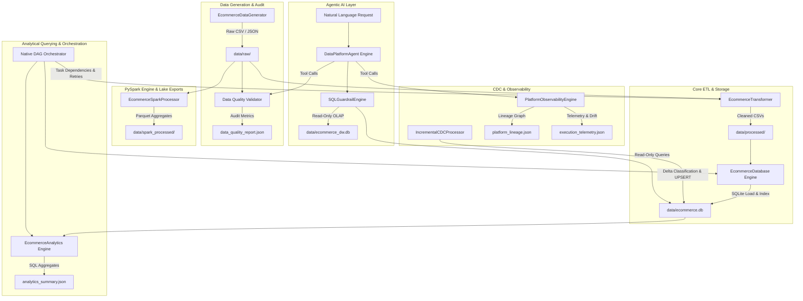

# Agentic E-Commerce Data Engineering Platform

A production-style, end-to-end e-commerce data engineering platform built using modern Python data processing paradigms, SQLite analytical storage, PySpark batch processing, native DAG orchestration, simulated Change Data Capture (CDC), automated platform lineage, data observability, Star Schema Data Warehouse, and an Agentic AI Assistant interface.

---

## Portfolio & Recruiter Highlights

This repository demonstrates production-grade data engineering patterns and software engineering best practices:

- **Heterogeneous Processing Engines**: Blends fast, lightweight local Python/SQLite engines for transactional (OLTP) and analytical (OLAP) processing with PySpark 3.5 for distributed data lake processing.
- **Strict Virtual Environment Isolation**: Implements a two-environment strategy (`.venv` Python 3.13 for core pipelines vs `.venv_spark` Python 3.12 for PySpark) to overcome C-API incompatibilities and prevent dependency bloat.
- **Native Task Graph Orchestrator**: Includes a custom-built DAG orchestrator supporting topological execution sorting, exponential backoff retries, and task status tracking without external heavy dependencies.
- **Data Quality & Observability Suite**: Automated multi-rule data auditing, directed node/edge lineage graph generation (`platform_lineage.json`), execution telemetry logging, schema drift detection, and numerical metric drift variance calculation.
- **Dimensional Data Warehousing**: Modeled conformed dimensions (`dim_customer`, `dim_product`, `dim_date`) and a central measure fact table (`fact_sales`) with surrogate key mapping and OLAP aggregation queries.
- **Safe Agentic AI Integration**: Natural-language assistant interface (`src/agent.py`) with an intent router and strict read-only SQL guardrail engine enforcing SQLite URI `mode=ro` connection security.
- **100% Test Coverage Assurance**: Fully tested codebase with **90 passing tests** across standard (`pytest`) and PySpark test suites.

---

## Table of Contents
1. [Project Overview](#project-overview)
2. [Problem Statement](#problem-statement)
3. [Project Objectives](#project-objectives)
4. [Technology Stack](#technology-stack)
5. [Architecture & Data Flow](#architecture--data-flow)
6. [Milestones Summary (1–11)](#milestones-summary-111)
7. [Directory Structure](#directory-structure)
8. [Environment Architecture](#environment-architecture)
9. [Installation & Setup](#installation--setup)
10. [CLI Usage Guide & Execution Flow](#cli-usage-guide--execution-flow)
11. [Change Data Capture (CDC) Architecture & Limitations](#change-data-capture-cdc-architecture--limitations)
12. [Observability & Lineage Engine](#observability--lineage-engine)
13. [Data Warehouse & Star Schema Architecture](#data-warehouse--star-schema-architecture)
14. [Agentic Data Engineering Assistant & Read-Only Safety](#agentic-data-engineering-assistant--read-only-safety)
15. [Generated Outputs & Metadata Artifacts](#generated-outputs--metadata-artifacts)
16. [Testing & Quality Verification](#testing--quality-verification)
17. [Known Limitations & Future Improvements](#known-limitations--future-improvements)

---

## Project Overview

The **Agentic E-Commerce Data Engineering Platform** is a complete, modular data platform designed to simulate, ingest, audit, transform, persist, analyze, and monitor relational e-commerce data assets. From synthetic raw generation to PySpark Parquet data lakes, Star Schema Data Warehouses, and natural-language agent querying, the platform provides a complete lifecycle for modern data engineering workflows.

---

## Problem Statement

Modern e-commerce organizations process relational data across multiple heterogeneous systems, introducing significant engineering challenges:
1. **Data Quality & Integrity**: Raw datasets often contain missing values, schema drift, invalid prices, or orphaned foreign keys.
2. **Analytical Performance**: Operational transactional databases (OLTP) are inefficient for multi-dimensional business analytics (OLAP).
3. **Pipeline Monitoring**: Data pipelines require dependency orchestration, task retry resiliency, telemetry tracking, and asset lineage visibility.
4. **Data Accessibility**: Business stakeholders require safe, read-only interfaces to query complex data assets in plain English without risking underlying database mutation.

This project resolves these challenges by delivering an audited, orchestrated, dual-engine data platform with built-in observability and an Agentic AI query assistant.

---

## Project Objectives

- **End-to-End Data Pipeline**: Deliver a complete flow from synthetic raw data creation to analytical storage and Parquet data lakes.
- **Robust Quality Engineering**: Enforce automated data validation, null/duplicate checks, and referential integrity constraints across raw and transformed data assets.
- **Heterogeneous Processing Engines**: Combine fast local Python/SQLite operations for transactional/analytical queries with PySpark for scalable distributed batch transformations.
- **Native Task Orchestration**: Build a lightweight, native DAG orchestrator supporting task dependency resolution, retries, topological sorting, and status tracking.
- **CDC & Observability**: Implement idempotent batch record classification (`INSERT`, `UPDATE`, `NO_CHANGE`) and track operational telemetry, lineage graphs, schema drift, and data drift.
- **Agentic AI Layer**: Provide an interactive natural-language assistant (`src/agent.py`) supporting read-only SQL guardrails, intent routing, and tool synthesis across all platform capabilities.

---

## Technology Stack

- **Core Programming**: Python 3.13.5 (Primary) & Python 3.12.10 (PySpark)
- **Batch Processing & Data Lake**: PySpark 3.5.4, PyArrow, Apache Parquet
- **Relational Databases**: SQLite 3 (OLTP `ecommerce.db` & OLAP `ecommerce_dw.db`)
- **Data Manipulation**: Pandas, NumPy
- **Orchestration**: Native DAG Engine (Topological Sort, Backoff Retries)
- **Agentic AI Engine**: Custom Intent Router, Pattern Parser, SQLGuardrailEngine
- **Testing & Verification**: PyTest (Dual-Suite Execution)
- **System Runtime**: Java OpenJDK 21.0.1 (JVM Runtime for PySpark)

---

## Architecture & Data Flow



---

## Milestones Summary (1–11)

| Milestone | Title | Key Deliverables & Implementation Highlights |
| :--- | :--- | :--- |
| **Milestone 1** | **Synthetic Data Generation** | Implemented `EcommerceDataGenerator` producing 5 core relational entities. |
| **Milestone 2** | **Data Quality Audit** | Created `DataQualityValidator` evaluating schema, null%, and integrity. |
| **Milestone 3** | **Data Transformation / ETL** | Created `EcommerceTransformer` to clean/normalize operational data. |
| **Milestone 4** | **SQLite Storage & Indexing** | Built `EcommerceDatabase` manager for schema and indexing. |
| **Milestone 5** | **SQL Analytics Engine** | Developed `EcommerceAnalytics` returning Pandas analytical metrics. |
| **Milestone 6** | **Pipeline Orchestration** | Implemented `NativeDAGOrchestrator` handling topological execution. |
| **Milestone 7** | **PySpark & Parquet Engine** | Developed `EcommerceSparkProcessor` for distributed aggregation. |
| **Milestone 8** | **Unified Platform CLI** | Created `run_platform.py` unifying all platform capabilities. |
| **Milestone 9** | **Incremental CDC & Observability** | Added `IncrementalCDCProcessor` and `PlatformObservabilityEngine`. |
| **Milestone 10** | **Data Warehouse & Star Schema** | Built `EcommerceDataWarehouse` with conformed dimensions. |
| **Milestone 11** | **Agentic Data Engineering Assistant** | Developed `DataPlatformAgent` with intent routing and guardrails. |

---

## Directory Structure

```
ecommerce-platform/
├── .gitignore                # Git ignore rules (includes ecommerce.db & ecommerce_dw.db)
├── .vscode/                  # VS Code Workspace settings
│   └── settings.json         # Python analysis extraPaths for PySpark
├── dags/                     # Orchestration DAG definitions
│   └── ecommerce_dag.py      # Native Task Graph definition
├── data/                     # Data assets (raw, processed, databases, parquet outputs)
│   ├── ecommerce.db          # SQLite operational (OLTP) database (Git ignored)
│   ├── ecommerce_dw.db       # SQLite Star Schema Data Warehouse (OLAP) (Git ignored)
│   ├── hadoop/               # Windows native Hadoop utilities (winutils.exe, hadoop.dll)
│   ├── processed/            # Cleaned datasets and observability JSON outputs
│   ├── raw/                  # Raw synthetic CSV & JSON datasets
│   └── spark_processed/      # Spark Parquet data lake outputs
├── main.py                   # Milestone 1 data generation entrypoint script
├── pyrightconfig.json        # Static type checker configuration for PySpark
├── requirements.txt          # Root Python dependencies with environment isolation notes
├── run_agent.py              # Standalone Agentic Assistant runner (Milestone 11)
├── run_analytics.py          # Standalone SQL analytics execution runner
├── run_incremental.py        # Standalone CDC and observability execution runner
├── run_orchestrator.py       # Standalone native DAG orchestrator runner
├── run_pipeline.py           # Standalone ETL pipeline execution runner
├── run_platform.py           # Unified Platform CLI entrypoint script
├── run_spark.py              # Standalone PySpark batch processor runner
├── run_warehouse.py          # Standalone Data Warehouse ELT builder runner
├── src/                      # Core source code modules
│   ├── __init__.py
│   ├── agent.py              # Agentic Assistant, intent router & SQL guardrails (M11)
│   ├── analytics.py          # SQL Analytics engine
│   ├── cli.py                # Unified CLI interface dispatcher
│   ├── database.py           # SQLite database persistence engine
│   ├── generator.py          # Synthetic data generator
│   ├── incremental.py        # Change Data Capture & SQLite upsert processor
│   ├── observability.py      # Lineage tracking & drift detection engine
│   ├── orchestrator.py       # Native DAG execution engine
│   ├── pipeline.py           # Core ETL pipeline executor
│   ├── spark_processor.py    # PySpark batch & Parquet processor
│   ├── transformer.py        # Data transformation engine
│   ├── validator.py          # Automated data quality auditor
│   └── warehouse.py          # Data Warehouse & Star Schema engine
└── tests/                    # Automated test suites (90 total tests passing)
    ├── test_agent.py         # Agentic Assistant & SQL guardrail tests (11 tests)
    ├── test_analytics.py     # SQL analytics engine tests (9 tests)
    ├── test_cli.py           # Unified CLI interface tests (10 tests)
    ├── test_database.py      # SQLite database persistence tests (5 tests)
    ├── test_generator.py     # Synthetic data generator tests (7 tests)
    ├── test_incremental.py  # CDC classification & upsert tests (5 tests)
    ├── test_observability.py # Lineage, telemetry & drift tests (6 tests)
    ├── test_orchestrator.py  # Native DAG orchestrator tests (7 tests)
    ├── test_pipeline.py      # ETL pipeline execution tests (4 tests)
    ├── test_spark.py         # PySpark processing & Parquet tests (8 tests)
    ├── test_transformer.py   # Data transformer tests (1 test)
    ├── test_validator.py     # Data quality auditor tests (2 tests)
    └── test_warehouse.py     # Data Warehouse & Star Schema tests (7 tests)
```

---

## Environment Architecture

The platform uses **two isolated Python virtual environments**:

1. **Primary Environment (`.venv`)**:
   - **Python Version**: `3.13.5`
   - **Scope**: Generation, validation, pandas, SQLite, DAG, CDC, CLI, Observability, Warehouse, Agent.
2. **PySpark Environment (`.venv_spark`)**:
   - **Python Version**: `3.12.10`
   - **Scope**: PySpark processing, Parquet exports.
   - **System**: Requires JDK 21.0.1.

---

## Installation & Setup

```powershell
# 1. Create primary virtual environment (Python 3.13.5)
python -m venv .venv
.\.venv\Scripts\python.exe -m pip install -r requirements.txt

# 2. Create dedicated PySpark virtual environment (Python 3.12.10)
C:\PathToPython312\python.exe -m venv .venv_spark
.\.venv_spark\Scripts\python.exe -m pip install pyspark==3.5.4 pandas pyarrow pytest
```

---

## CLI Usage Guide & Execution Flow

The unified CLI entrypoint `run_platform.py` allows executing individual platform stages or the entire pipeline.

```powershell
# Run synthetic data generation
.\.venv\Scripts\python.exe run_platform.py --generate

# Run full end-to-end platform flow (Milestones 1–11)
.\.venv\Scripts\python.exe run_platform.py --all
```

---

## Change Data Capture (CDC) Architecture & Limitations

The CDC engine ([`src/incremental.py`](file:///c:/Users/Neha/ecommerce-platform/src/incremental.py)) processes batch delta records using primary key classification:
- **`INSERT` / `UPDATE` / `NO_CHANGE`**
- Uses SQLite `ON CONFLICT DO UPDATE` (`UPSERT`) for idempotency.
- *Note*: This is a simulated local batch processor, not a real-time streaming service.

---

## Observability & Lineage Engine

The platform observability engine ([`src/observability.py`](file:///c:/Users/Neha/ecommerce-platform/src/observability.py)) tracks:
1. **Lineage Node & Edge Graph**: Exports to `data/processed/platform_lineage.json`.
2. **Execution Telemetry**: Records duration and throughput.
3. **Schema Drift Detection**: Validates against expected column schemas.
4. **Data Drift Detection**: Calculates metric variance relative to baselines.

---

## Data Warehouse & Star Schema Architecture

The data warehouse engine ([`src/warehouse.py`](file:///c:/Users/Neha/ecommerce-platform/src/warehouse.py)) structures operational data into `data/ecommerce_dw.db`:
- **Dimensions**: `dim_customer`, `dim_product`, `dim_date`.
- **Fact Table**:
  - `fact_sales`: Measure fact table linking surrogate keys (`customer_key`, `product_key`, `date_key`) with order metrics (`quantity`, `unit_price`, `total_price`).
- **OLAP Queries**: Enables rapid category revenue drill-downs and weekend vs weekday performance analysis.

---

## Agentic Data Engineering Assistant & Read-Only Safety

The Agentic Assistant ([`src/agent.py`](file:///c:/Users/Neha/ecommerce-platform/src/agent.py)) provides an intelligent, natural-language interface across all platform capabilities:
- **Intent Router**: Maps natural-language user prompts to underlying platform tool functions (Analytics, Data Warehouse, Quality Auditor, Observability, CDC, Spark).
- **Read-Only SQL Guardrail Engine**: Validates queries to ensure strictly read-only SELECT execution, prohibiting DDL/DML modification statements (`DROP`, `DELETE`, `UPDATE`, `INSERT`, etc.) and enforcing URI mode read-only connections (`mode=ro`).
- **Result Synthesizer**: Formats raw DataFrames and metadata dictionaries into clean Markdown tables and human-readable explanations.

---

## Generated Outputs & Metadata Artifacts

| Path / File | Purpose |
| :--- | :--- |
| **`data/ecommerce.db`** | Operational (OLTP) database |
| **`data/ecommerce_dw.db`** | Star Schema Warehouse (OLAP) |
| **`data/processed/*.json`** | Lineage, Telemetry, Drift, and Audit metadata |
| **`data/spark_processed/`** | Parquet data lake exports |

---

## Testing & Quality Verification

- **Total across both suites**: 90 passed

### Standard Test Suite (`.venv`)
```powershell
.\.venv\Scripts\python.exe -m pytest
```
**Result**: **`82 passed`**

### Dedicated PySpark Test Suite (`.venv_spark`)
```powershell
.\.venv_spark\Scripts\python.exe -m pytest tests/test_spark.py -v
```
**Result**: **`8 passed`**

---

## Known Limitations & Future Improvements

*The following features represent potential architecture enhancements for production scaling and are not currently implemented:*

- **Real-Time CDC & Event Streaming**: Integrating Kafka / Debezium for database transaction log tailing.
- **Cloud Data Warehousing**: Migrating analytical storage from local SQLite to Snowflake or BigQuery.
- **Workflow Scheduling**: Migrating native local DAG execution to Apache Airflow or Prefect.
- **Containerization**: Packaging services into Docker containers and orchestrating with Kubernetes.
- **Advanced Observability Dashboard**: Building a web interface (Streamlit / Grafana) to visualize real-time lineage graphs and drift metrics.
